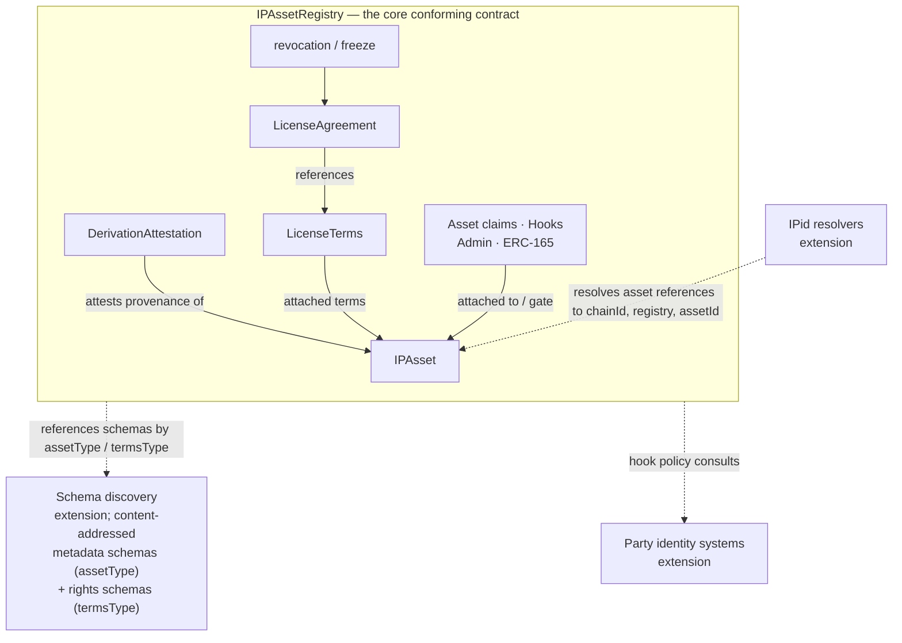
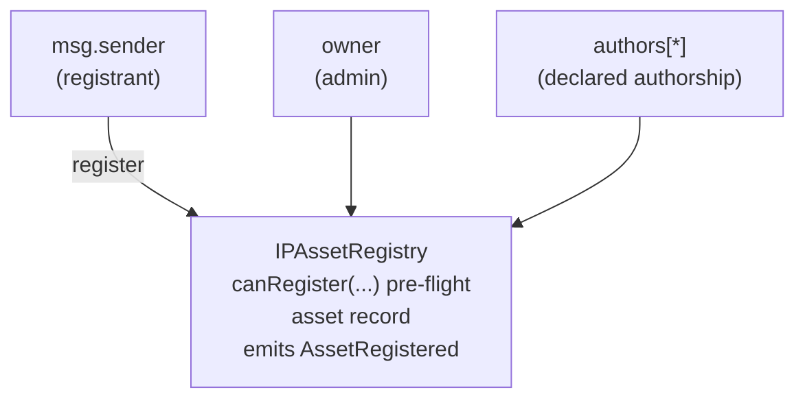
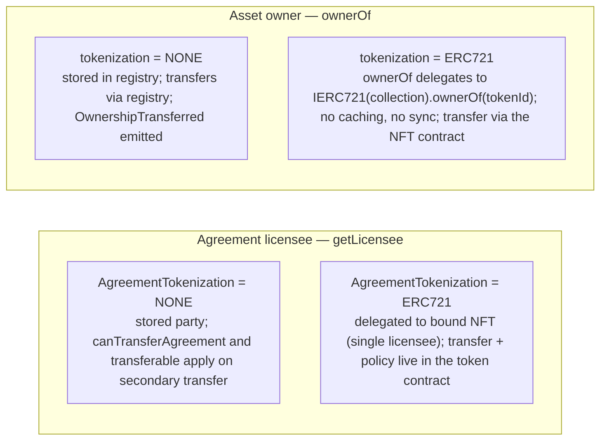
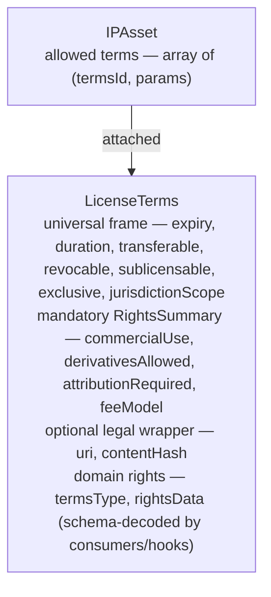
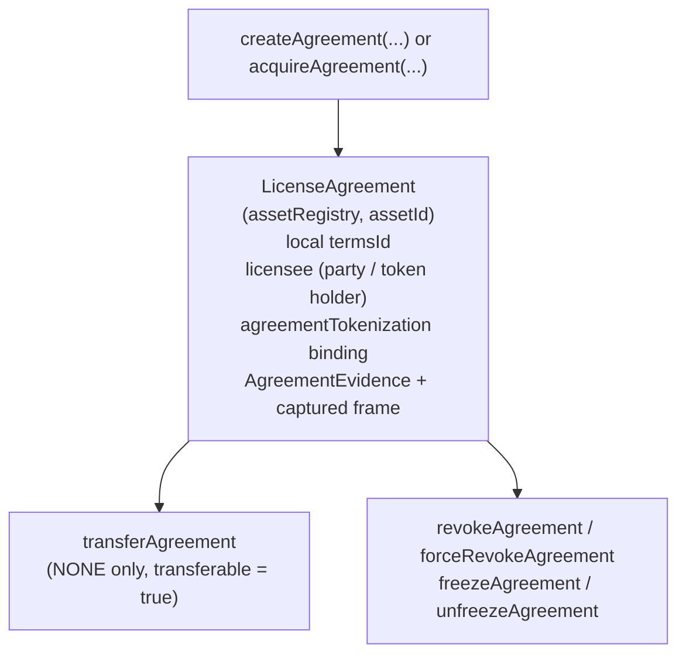
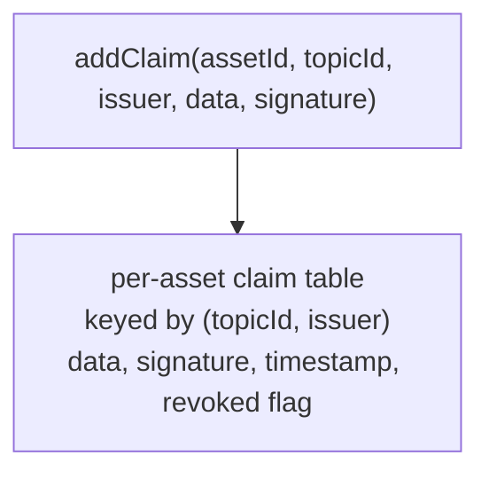

# ERC Core Architecture

> Non-normative guide to the authoritative [ERC draft](erc-draft.md).
> R-numbers refer to the expanded [requirements](requirements.md).
> Read top-down for concepts, interface dependencies, and details; see
> [design principles and rationale](design_decisions.md) for the reasoning.

## 1. Concepts at a glance

The diagram below is the one-screen map of the whole ERC. It shows the
single core contract (`IPAssetRegistry`), the records and surfaces it
hosts (solid arrows show their relationships), and the
three kinds of extension services that can build on the core but that it does
not depend on (dashed arrows). Use it as orientation; each box is detailed
in the sections that follow.

The core ERC is a single conforming contract: the `IPAssetRegistry`. It
hosts four kinds of records:

- **IP Assets** — what is being licensed. Identifying data, owner,
  authors, metadata pointer, derivation attestation. (R1–R14, R23–R26)
- **License Terms** — content-addressed, reusable, immutable
  descriptions of permitted use. (R16–R17)
- **License Agreements** — bindings of (asset, terms, licensee) with
  an optional single-token binding (a tradable/bearer license). (R19–R22)
- **Asset claims** — typed, signed attestations attached to assets;
  the implementer-controlled policy surface for compliance, KYC, and
  third-party vouching. (R6d, R30)

The core defines no interfaces for these extension services:

- **IPid resolvers** map alternative namespaces (catalog-native, DID-based,
  rights-society-native) to the canonical `(chainId, registry, assetId)`
  tuple. The canonical `ipid:` form is parseable without any resolver. (R2a)
- **Schema discovery** locates the documents behind `assetType` metadata
  schemas (R6c) and `termsType` rights schemas (R16c). Consumers hash the
  retrieved canonical bytes against the requested id rather than trusting a
  pointer. (R16d)
- **Party identity systems** inform hook policy for KYC/AML, sanctions, and
  jurisdiction decisions. Hook signatures remain address-based; identity
  lookup is internal to policy implementations. (R35–R37)

## 2. Identifiers and canonical references

Three of the four record kinds — IP Assets, License Terms, and License
Agreements — share the same identifier shape: a `bytes32` id unique within
the issuing registry, with canonical global identifier
`(chainId, registry, id)`. Asset claims (R6d/R30) are the exception: they
are keyed by the composite tuple `(assetId, topicId, issuer)` and have no
single-id string form, because a claim is always *about* an asset rather
than a top-level record.

The string form of the three single-id tuples is defined in the core and
parseable without any onchain lookup. All three share identical syntax
after the prefix:

| Kind             | Prefix         | Defined in        |
| ---------------- | -------------- | ----------------- |
| IP Asset         | `ipid:`        | R2                |
| License Terms    | `ipterms:`     | R17               |
| LicenseAgreement | `ipagreement:` | R19 (symmetric)   |

Reference encoder/decoder library: `src/IpRef.sol`. The original
`src/IPid.sol` is a thin back-compat alias exposing the asset-specific
surface.

Content commitments include:

- `termsId` = `keccak256(canonical LicenseTerms encoding)` — terms are
  immutable by construction. (R17)
- `termsType` = `keccak256(canonical schema document)` — schemas are
  pinned by their content. (R16c)
- Asset `contentHash` — immutable `keccak256` anchor of exact original-work
  representation bytes, nonzero for `NONE` and optionally zero for `ERC721`.
  The work can be off-chain, onchain, or hybrid. Only `metadataURI` is mutable;
  it describes retrieval/reconstruction and is not necessarily the hashed
  document. Neither the pointer nor a token binding guarantees integrity. (R6a)

`assetId` and `agreementId` are not content-addressed — both records carry
mutable state (owner, attached terms, licensee, agreement activity). `assetId` is
derived from a registrant-chosen `salt` as
`keccak256(abi.encode(chainId, registry, registrant, salt))` (R1), where
`registrant = msg.sender`. This keeps it
deterministic and **pre-computable** before registration — required so a
derivation attestation can be signed over it (R23/R24) — while still letting a
registry opt into per-registrant content-addressed de-duplication by setting
`salt = contentHash`. `agreementId` is derived at creation as
`keccak256(abi.encode(chainId, registry, assetId, agreementIndex))`, where
`agreementIndex` is the asset's append-only pre-insertion agreement count
(R19). It is deterministic from registry state but is not a commitment to the
agreement's contents.

## 3. Identity and registration flow

Three roles are distinct at registration time (R8):

- **Registrant** is transient — recorded in the event for audit, no
  persistent authority (R8).
- **Owner** controls asset mutations, terms attachment, grants, and ordinary
  revocation, with explicitly authorized delegates under documented policy.
  This is distinct from issuer authority over claims and registry
  governance/administrative authority (§8–§9); no operator role is standardized.
- **Authors** record declared authorship with per-author share —
  immutable after registration (R10, R11).
- **Derivation attestation**, if any, is supplied at registration only and
  also immutable (R23, R24).

## 4. Tokenization invariant

`AgreementTokenization` is `{ NONE, ERC721 }`, deliberately symmetric with
the IP-asset `AssetTokenization` enum — every agreement is single-holder. ERC-1155
is intentionally NOT an agreement mode: a multi-holder edition would make
revocation all-or-nothing and `isAgreementActive` per-holder ambiguous.
Editions are expressed as N single-holder agreements; mass-fungible editions
are a future extension. See the rationale log for the full argument.

The registry enforces `transferable` only for `NONE` agreements.
For `ERC721`, it records the value but follows the bound token's holder even if
an unrestricted token transfers contrary to the terms. Such a transfer is not
automatically an inactive agreement; enforcement must live in the token
contract, or the deployment must use `NONE`.

Because the `ERC721` rows delegate to an external `ownerOf`, the delegated
read MUST be **failure- and gas-grief-safe**: the registry uses a gas-capped,
success-checked call and returns `address(0)` for a revert, exhausted stipend,
or malformed result rather than propagating the failure —
otherwise the non-revert guarantee of the R20/R27/R27a views and the R31
hooks would break. A token with no holder is treated as "no current
owner/licensee", and the agreement is consequently inactive (R5, R20, R22).
The reference implementation forwards at most 100,000 gas to each ownership
query.

An `ERC721` asset may be registered only with canonical
`RegistrationParams.owner == address(0)`, a non-zero collection containing
contract code, and a bounded canonical `ownerOf(tokenId)` result resolving a
non-zero holder. `AssetRegistered` emits that resolved holder; the registry
stores only the token binding and never caches the owner.

## 5. License terms and attachment

Terms are *reusable*. One local `LicenseTerms` record can back many assets in
the registry. Another registry can mirror the exact value and obtain the same
content-addressed `termsId` (R17).

`attachTerms(assetId, termsId, params)` makes a locally registered terms record
eligible for agreement creation against the asset. Detachment
blocks creation of new agreements but does NOT invalidate existing
ones (R18).

An attachment can never be dangling: terms must already be registered in the
asset registry. Terms discovered in another registry or chain must be mirrored
locally before attachment; the exact value retains the same `termsId`.

`termsType` is a content-addressed schema id. The core defines exactly one
normative schema, `generic-license-v1`, including its canonical JSON hash
preimage in [ERC draft §1.6](erc-draft.md#16-well-known-constants).
Standardized domain-specific schemas are future work for ERC extensions.
With `termsType == bytes32(0)`, the mandatory summary
is the complete machine-readable rights expression. The legal wrapper is absent
only when both `uri` is empty and `contentHash` is zero; when present, its hash
commits to the exact canonical legal-document bytes.

All terms layers must be semantically consistent. The universal frame controls
registry behavior; schemas and legal text may add detail but may not override
machine-readable assertions. Conflicting terms are non-conforming rather than
resolved by a hidden precedence rule.

## 6. License agreement lifecycle

An attached `termsId` is an asset-level standing offer:
qualifying callers can invoke `acquireAgreement` without another owner
transaction or signature. Qualification is decided by current creation
invariants and `canLicense`, which may consult `attachmentParameters`.
Attachment alone grants no rights. An agreement record is created by a successful
owner-authorized `createAgreement` grant or qualifying `acquireAgreement`, not as
proof of legal enforceability. Attachments persist across ownership changes
until detached; reattachment can update their parameters. The owner current at
agreement creation is recorded as licensor.

Activity (`isActiveAgreementHolder`, `isAgreementActive`, `activeAgreementsOf`) means
only: has a current licensee, not expired, not revoked, not frozen — not legal
validity or permission for a use. These views are permissionless and
non-reverting (R20). A license
always has a licensee at creation — there is no unassigned state (R19);
"mint now, sell later" is either create-at-sale (`NONE`, gated by
`canLicense`) or mint-then-transfer the bound token (`ERC721`). An `ERC721`
agreement can be created only when its collection is non-zero and the bounded
`ownerOf` query resolves a non-zero initial holder; later burning or query
failure makes the existing agreement inactive.

`AgreementEvidence.licensor` and `initialLicensee` are immutable creation-time
snapshots. Raw `agreementOf.party` is the mutable stored licensee for `NONE`
and zero for `ERC721`; `getLicensee` resolves the live holder in either mode.
The captured agreement expiry is the earlier nonzero deadline from the terms'
absolute `expiry` and `createdAt + duration` (omitting a zero duration); both
absent means perpetual.

`isActiveAgreementHolder` verifies a supplied `agreementId` in constant work.
When no witness is available, the per-party `activeAgreementsOf` overload scans
the asset's append-only list, returning `(agreementIds, nextCursor)`.
`limit` bounds records examined, not returned; an empty page need not end the
scan. Snapshot absence requires a complete scan from zero to
`agreementCountOf(assetId)` at one chosen state. The core cannot require a
reliable party index because arbitrary bound ERC-721 tokens transfer outside
the registry. Each returned agreement's own terms need separate evaluation.

`revokeAgreement` requires the current asset owner or an explicitly authorized
delegate, captured `revocable == true`, and `canRevoke` approval; `forceRevokeAgreement` is
the separately authorized, non-hook-gated break-glass path. Revoked agreements
remain in storage for audit (R21). Freeze is reversible; revocation is not.

## 7. Derivation and provenance

A `DerivationAttestation` is OPTIONAL on each asset (R23). It is a
**dedicated structural field** on the asset record, not an entry in the
generic asset-claims interface of R6d/R30 — the name avoids the word
"Claim" deliberately to prevent confusion with claim-topic entries.
Its exact EIP-712 digest binds the intended registrant and complete initial
registration payload through a stored `registrationHash`, in addition to the
asset id, parents, and attestation metadata. This prevents mempool replay onto
altered registrations or by a different caller.
Three semantic states:

| State                       | Encoded as |
| --------------------------- | ---------- |
| No onchain statement       | canonical empty attestation (zero issuer and registration hash; empty parents, signature, and metadata) |
| Explicit "original work"    | attestation present, `parents.length == 0`, valid signature |
| Derived from one or more X  | attestation present, `parents.length > 0`, valid signature |

`issuer == address(0)` is valid only for that completely empty encoding. A
zero issuer with any other populated attestation field is malformed and causes
registration to revert; fields are never silently ignored.

The `issuer` MAY be the registrant themselves, a piece of software (a
remix tool, AI training pipeline, video compositor signing that only
listed inputs were used), or a third-party oracle. Legal weight
depends on who the consumer trusts. The core ERC verifies the
signature and emits `DerivationAttestationRegistered`; it does not validate
that the listed parents were actually used and it does not walk derivation
graphs (an extension concern, §12).

`canDerive(parentAssetId, deriver)` is the pre-flight hook a would-be
deriver calls *before* preparing a derivation. Policy may inspect active
agreements and their own terms, including the rights summary and schema-decoded
`rightsData`. It returns `(bool ok, bytes32 reason)`: an advisory policy answer,
not a legal-permission verdict or a core gate on child registration. (R26)

## 8. Hook surface and policy

Eligibility policy is exposed through `view` hooks, separately from mandatory
write authorization. Owner/licensee-controlled operations require the relevant
holder or an explicit delegate; claims require issuer authority; trust
configuration requires governance authority (§9). Matching writes enforce current
hook policy as well as authorization. Each hook:

- is permissionless (any caller can pre-flight),
- returns `(false, reason)` to deny (does not revert), `(true, bytes32(0))` to allow,
- does not revert on unknown inputs,
- MAY be implemented to return `(true, bytes32(0))` unconditionally.

The canonical hook list (R31):

| Hook                | Gates                                    |
| ------------------- | ---------------------------------------- |
| `canRegister`       | new asset registration (R9)              |
| `canUpdateMetadata` | mutable `metadataURI` updates only (R6a) |
| `canTransferAsset` | administrative ownership transfers of `NONE` assets (R14) |
| `canTransferAgreement` | licensee transfers of `NONE` agreements (R19, R22) |
| `canAttachTerms`    | attaching allowed terms to an asset (R18) |
| `canDetachTerms`    | detaching attached terms (R18)            |
| `canLicense`        | creating / acquiring a license agreement (R19, R31) |
| `canRevoke`         | standard revocation path (R21)            |
| `canDerive`         | derivation pre-flight (R26)               |

Administrative paths (`freezeAsset`, `unfreezeAsset`, `freezeAgreement`,
`unfreezeAgreement`, `forceRevokeAgreement`) are NOT hook-gated. They require
the registry's documented administrative/governance authority; a permissive hook
never authorizes an unrelated caller.

Asset freeze and agreement freeze are deliberately different. Freezing an
asset blocks new attachments and both agreement-creation paths but leaves existing
agreements' activity unchanged. Freezing an agreement makes only that agreement inactive
until it is unfrozen; neither operation deletes historical state.

## 9. Asset claims (compliance and attestation surface)

Claims are the *attestation-shaped* extension surface (R6d, R30).
Authorship (R10) and derivation (R23) are NOT R30 claim-topic entries:
authorship is a structural `Author[]` field; derivation is a structural
`DerivationAttestation` field — both immutable at registration.
The claims interface is for everything else: KYC, age ratings,
sanctions, third-party vouching, jurisdiction-specific status,
performance credits, extension-specific facts.

The core ERC ships zero well-known topic ids. Extensions and
implementers mint topic ids using the same
`keccak256(<descriptive lowercase ASCII string>)` convention as asset types.

`setTrustedIssuer` is a hint to the implementer's hooks and downstream
extensions; the core does not itself dispatch on `isTrustedIssuer`. Every
change emits `TrustedIssuerChanged`, making trust-policy history reconstructable.

Claim authorization policy is implementation-defined, but claim identity is not
forgeable by arbitrary callers: each write must come from the named issuer or a
documented delegate/administrator authorized to act for it. Trusted-issuer
configuration is restricted to documented registry governance. Neither form of
authorization substitutes for verification of the stored claim signature.

Revoked claims remain queryable through `getClaim` (with
`revoked == true`) so audit trails survive revocation.

## 10. Discoverability and events

The view surface (R27) answers runtime queries:

- Per `assetId`: owner, authors, tokenization, asset type, metadata
  pointer, derivation attestation, attached terms, active agreements,
  claims.
- Per `agreementId`: bound asset, terms, licensee, tokenization, creation
  evidence, and lifecycle state.
- Per `termsId`: full LicenseTerms struct.
- Per supplied `(agreementId, assetId, party)`: constant-work holder/activity
  witness check via `isActiveAgreementHolder`.
- Per `(assetId, party, cursor, limit)`: bounded active-agreement discovery,
  not an existential permission boolean (§6).

The event surface (R29) records core lifecycle history. For `ERC721` assets,
indexers first obtain collection/id from `tokenizationOf`; `AssetRegistered`
omits those fields. `LicenseAgreementCreated` does carry the agreement's binding
and immutable creation evidence. Track registry mutations and the bound tokens'
`Transfer` events, supplementing them with historical queries where needed:
delegated holder reads can change or fail without transfer logs. Events alone
do not prove every external contract's behavior or the time of creative use.
See the [historical verification example](erc_overview.md#67-verify-a-derivation-external-verifier).

Cross-registry and cross-chain discovery (R28) is achieved through
the canonical IPid string form. Every conforming registry exposes
`chainId()`, the nonzero EIP-155 chain id frozen at deployment, so off-chain
consumers can canonicalise an IPid without prior knowledge of which namespace
a registry uses. The value does not change if live `block.chainid` changes.
There is no
onchain registry-of-registries; catalogs (extension) and resolvers
(extension) curate that.

## 11. ERC-165 and interface discovery

Every conforming `IPAssetRegistry` MUST implement ERC-165's
`supportsInterface` and MUST return true for the ERC-165 interface id
plus the `IIPAssetRegistry` interface id (`0x72117f80`) and the inherited
`ITermsRegistry` interface id (`0x38c7f550`), both computed from
`src/interfaces/` and locked by `test/InterfaceId.t.sol`; re-pinned only
if the interfaces change. (R33)

Without `supportsInterface`, catalogs, wallets, and extensions have
no onchain way to detect that a contract claims to be a conforming
registry. Advertising support does not prove behavioral conformance, registry
honesty, genuine works, or legal rights; consumers assess those separately.

## 12. Out of scope (deliberately)

The following live in extensions, not in the core:

| Extension | Notes |
| --- | --- |
| Jurisdictions & KYC | Read claims (R6d); define their own jurisdiction and compliance policy |
| Catalogs | Curated registry-of-registries; trust filtering downstream |
| Asset Graphs (DAGs) | Walk `derivationAttestationOf` recursively |
| Payment & Royalty Schemes | Beneficiaries, revenue splits, settlement, and IPfi tokenization |
| IPid resolvers | Namespace translation to canonical asset tuples (R2a) |
| Schema discovery | Locating content-addressed metadata and rights schemas (R16d) |
| Party identity adapters | Adapt ONCHAINID, DID+VC, ERC-8004, or other identity systems for hook policy (R35–R37) |

The core ERC defines just enough mechanism for these extensions to
plug in:

- IPid canonical form (R2) → resolvers and catalogs use it as the
  canonical reference;
- Claims interface (R30) → compliance modules and jurisdiction
  modules read it;
- Derivation attestation (R23) → asset graphs walk it;
- Author shares (R10/R11) and
  `transferable`/`revocable`/`exclusive`/`expiry`/`duration`/`sublicensable` (R16a) →
  downstream extensions read them; `sublicensable` alone creates no core
  sublicense relationship;
- ERC-165 (R33) → extensions discover advertised interface support.
