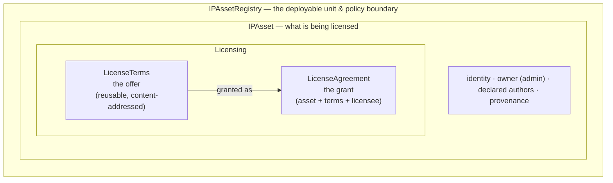
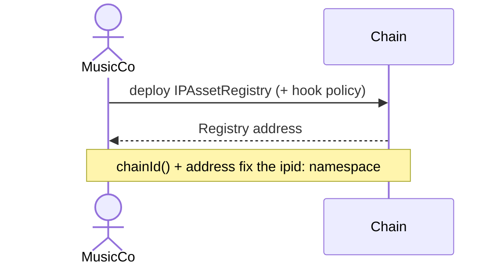
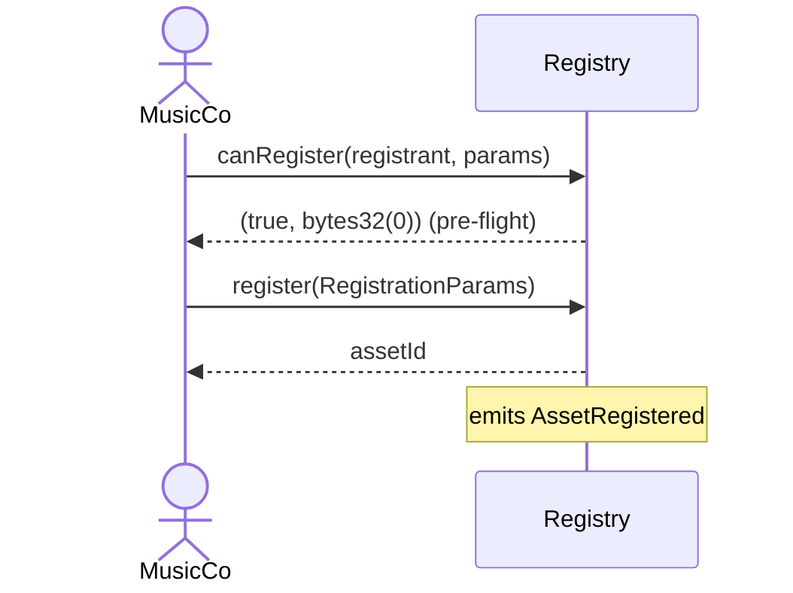
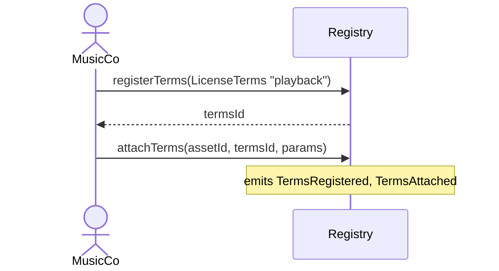
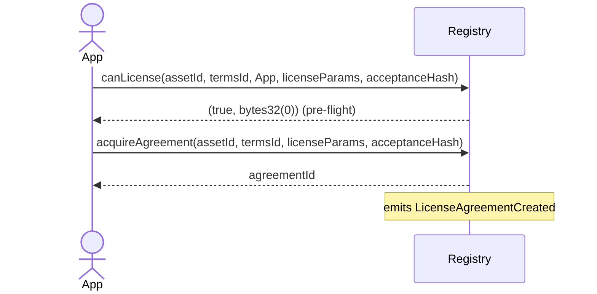
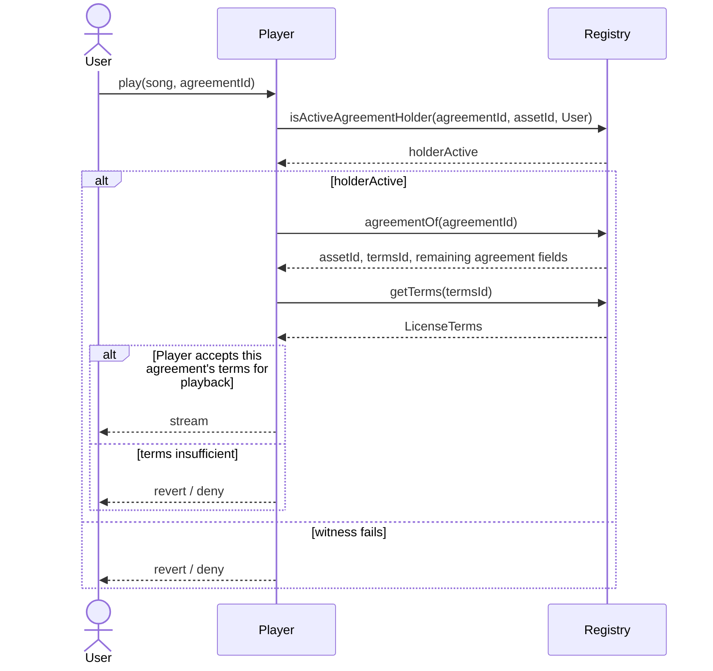
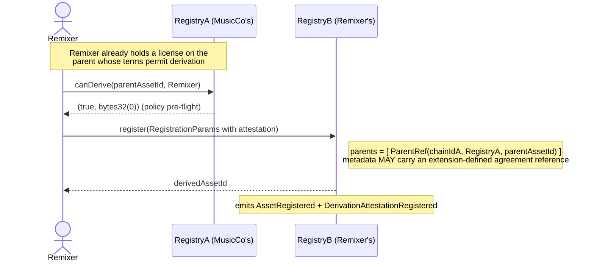
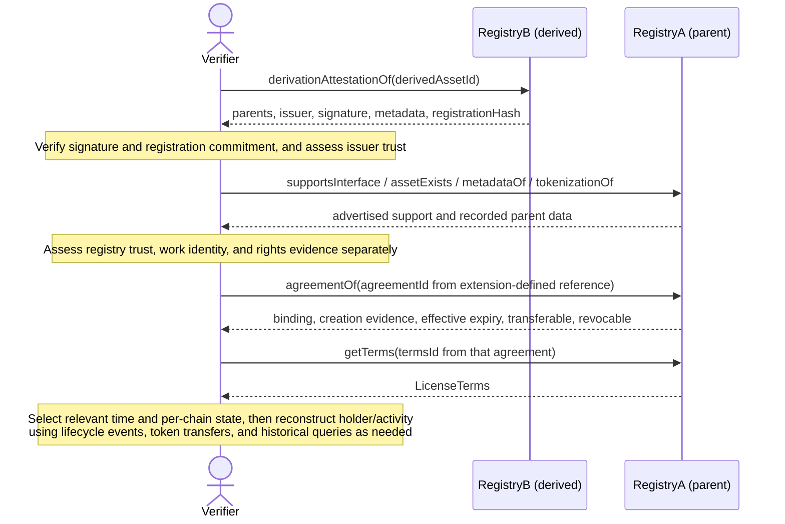

# ERC Overview — Onchain IP Licensing

> A getting started introduction to this ERC

## 0. In one sentence

**A policy-neutral onchain registry standard for declaring IP assets and
licensing them — for off-chain, onchain, and hybrid works — with canonical
references across chains and registries, inspectable terms, and agreement/holder
state that contracts and agents can use alongside their own trust and rights checks.**

## 1. Why this exists

Today, ownership of a token (ERC-721) and *rights to a work* are two different
things — and the second one lives in PDFs, platform databases, and email
threads that no smart contract can read. There is no neutral, onchain way to
express **who authored a work, under what terms it may be used, and whether a
given party currently holds an active agreement** — so every dapp, marketplace, and
service reinvents its own off-chain, non-interoperable rights handling.

This ERC fills that gap with a small, neutral primitive: a registry that holds
*assets*, *terms*, and *agreements*, and exposes agreement activity through
permissionless witness checks and bounded discovery. It is a **flexible IP-rights framework
standard** any software can build on — dapps, marketplaces, payment and royalty
systems, and catalogs. It standardizes the **mechanism**, never the policy.

**Why this matters for AI agents.** Autonomous agents increasingly create,
remix, and transact on creative and technical works at machine speed and scale.
Machine-readable records let them *inspect provenance claims, active agreements,
and terms before acting*, and *acquire or grant licenses* through the same
interface as a dapp. This reduces reliance on platform-specific APIs, but does
not remove legal interpretation, off-chain evidence, or trust decisions.

### Supported types of intellectual property

The core is designed for a broad IP surface, including music/audio, video,
images, text, software, datasets, models, patents, and algorithms. The
well-known set is intentionally practical (for interoperability), but open:
implementers can declare additional asset types without changing the core ERC.

## 2. The mental model in one picture

The core is three nested conceptual layers. Read it outside-in: a *registry*
contains *assets*; an asset is licensed via reusable *terms*; a concrete
*agreement* grants those terms to a licensee.

| Layer | One-line gloss |
| --- | --- |
| **IPAssetRegistry** | The container and the trust/policy boundary. *Anyone* can deploy one. |
| **IPAsset** | The thing being licensed — identity, owner, authors, provenance. |
| **LicenseTerms** | The reusable, content-addressed *offer*: what may be done, under what frame. |
| **LicenseAgreement** | The concrete *grant* binding (asset, terms, licensee) — verifiable onchain. |

## 3. The three layers

- **IPAssetRegistry** — The unit of deployment. Permissionless to launch; there
  is no blessed registry and no central authority. Each registry sets its own
  eligibility policy (KYC, jurisdiction) through hooks and documents its
  mandatory authorization roles, so a music rights society and a hobbyist
  remix tool can both be conforming without sharing rules. Trust is filtered
  *downstream* by catalogs and integrators. Canonical
  references (`ipid`, `ipterms`, `ipagreement`) make records inherently
  composable across registries and, for off-chain consumers, across chains.

- **IPAsset** — What is being licensed, and the record a registry groups and
  holds. Each asset captures its identity, the **owner** (an administrative
  role), the **authors** (immutable declared authorship), an **asset type** (a
  descriptive label — audio, video, image, text, software, dataset, model,
  patent, algorithm, … — from an open, well-known set), and an optional
  provenance attestation. The work may be off-chain, onchain, or hybrid; the
  registry record is distinct from the work. An immutable `contentHash` commits
  to exact original-work representation bytes: nonzero for `NONE`, optionally
  zero for `ERC721`. Neither a token binding nor a hash proves legal rights. Assets
  also carry **claims**: typed, signed attestations *about* the asset (KYC /
  eligibility, age ratings, third-party vouching, jurisdiction status) that
  hooks and compliance modules can dispatch on, without baking any policy into
  the core. All of an asset's records live inside the registry that issued it.
  Every asset is globally identified by the tuple **(chainId, registry,
  assetId)** — unique within its registry, and globally unique once the chain id
  and registry address are included. That tuple is exactly what the canonical
  `ipid:` string encodes, making any asset referenceable across registries and
  chains. 

- **LicenseTerms & LicenseAgreement** — Terms are the **offer**: reusable,
  content-addressed, immutable descriptions of permitted use: a universal frame,
  mandatory rights summary, optional legal wrapper, and domain-specific rights
  payload. An agreement is the **grant**: it binds an asset, terms, and a licensee,
  and its activity (has a licensee and is neither expired, revoked, nor frozen) is a
  permissionless onchain read, not a legal-permission verdict.

> See the [architecture](core_architecture.md) for tokenization and identity details.

## 4. Key design principles

This summary follows the [design principles](design_decisions.md#design-principles).
The [ERC draft](erc-draft.md) is authoritative; [requirements.md](requirements.md)
expands it using stable R-number references.

1. **Permissionless protocol layer.** Anyone may deploy a registry; the core
   defines no gatekeeper, allow-listing, or central authority. Trust filtering
   is downstream (catalogs, integrators, reputation), not at the protocol layer.
2. **Eligibility hooks do not replace authorization.** Permissionless `canX`
   pre-flights expose policy such as KYC or jurisdiction. Writes separately
   enforce owner/licensee or delegate authority, issuer-controlled claims, and
   governance roles. Freeze/unfreeze and force revocation use documented
   administrative authorization, not hooks. Pre-flight approval is advisory.
3. **Separate commitments from pointers.** Onchain claims can inform policy
   (R6d). The descriptive `metadataURI` is mutable; the original-work
   `contentHash` is not. The hash does not generally cover the metadata document
   or guarantee retrieval (R6a).
4. **Roles are independent.** Owner ≠ Author ≠ Licensee. Beneficiary is a
   separate economic role for extensions, not a fourth core record or query.
   One address may hold several roles; none alone proves underlying legal rights.
5. **Narrowest useful primitive.** The core standardizes only what
   cross-implementation composability requires; everything else is an extension.

## 5. Core vs. extension (scope at a glance)

| In the core ERC | Left to extensions |
| --- | --- |
| Registry, IPAsset, LicenseTerms, LicenseAgreement | Asset graphs / derivation DAGs |
| Policy **hooks** + administrative paths | Payments, royalties, revenue splits |
| Canonical events + `view` read paths | Jurisdiction modules, KYC/AML |
| `ipid:` / `ipterms:` / `ipagreement:` canonical references across registries/chains | Catalogs (registry-of-registries) |
| ERC-165 discovery; address-based roles and hooks | Identity abstractions and adapters (DID, ONCHAINID, …) |

The core defines *just enough* mechanism for these extensions to plug in —
notably the canonical reference form, the claims interface, the derivation
attestation, and ERC-165 discovery.

An `ipterms:` reference can identify terms in any registry for off-chain
discovery, but an asset attaches only terms registered in its own registry.
Exact terms can be mirrored locally without changing their content-addressed
`termsId`.

## 6. Basic flows

> Short "actors → calls → result" sketches, kept deliberately lighter than
> the full worked example in `key_interaction_flows.md`. Worked example: a
> **music rights-holding company** (`MusicCo`) that registers a song and lets a
> streaming app license playback.
>
> Actors: **MusicCo** (registrant + owner) · **Registry** (the conforming
> `IPAssetRegistry`) · **App** (the licensee) · **Player** (an onchain,
> ERC-aware contract that trusts the registry).

### 6.1 Deploy a registry

MusicCo stands up its *own* conforming registry and bakes its policy (KYC,
allowed jurisdictions, who-may-license) into the hooks. No permission needed —
deployment is permissionless.

*Result:* a conforming `IPAssetRegistry` whose assets are addressable as
`ipid:<chainId>:<registry>/<assetId>`.

### 6.2 Register an IP Asset (the song)

MusicCo registers a `NONE` asset for this example's off-chain recording. Its
hash anchors the exact recording bytes; the registry records administrative
owner, declared authors, and a mutable metadata pointer.

*Result:* a song asset with owner, declared authors and shares, and a
tamper-evident `contentHash`.

### 6.3 Register LicenseTerms for playback

MusicCo registers reusable **playback** terms, then **attaches** them to the
song to make them eligible for agreements. Terms are content-addressed and
reusable across many songs in the registry.

*Result:* the song now *offers* playback terms (`ipterms:` reference), priced
and gated by the attachment parameters / hooks.

### 6.4 Obtain a LicenseAgreement

The streaming app acquires a license under the attached terms. Creation
invariants and `canLicense` gate acquisition; payment checks, if any, are
extension policy. The agreement binds asset + terms + licensee.

*Result:* a live `LicenseAgreement` (`ipagreement:` reference) with `App` as
licensee. Its record and creation event preserve the licensor snapshot, creator,
initial licensee, creation time and mode, evidence hashes, token binding, and
captured lifecycle frame. (MusicCo could instead push a grant via
`createAgreement`.)

### 6.5 Inspect active agreements onchain

A `Player` contract that trusts MusicCo's registry receives an agreement witness
from the user, verifies it, then evaluates that agreement's terms before acting.

*Result:* the witness check verifies holder/lifecycle state in constant work,
not permission for playback. Wallets and indexers can discover candidates with
`activeAgreementsOf(assetId, party, cursor, limit)`, returning
`(agreementIds, nextCursor)`. `limit` bounds records examined, not returned.
To establish snapshot absence, consumers scan from zero through
`agreementCountOf(assetId)` at one chosen state; an empty intermediate page
does not suffice. Each candidate's own terms still need evaluation.

### 6.6 Register derived IP in *another* registry (with permission)

A remixer wants to register a derivative of MusicCo's song — but in their *own*
registry (`RegistryB`), not MusicCo's (`RegistryA`). They first obtain
a license on the parent whose terms allow derivation, consult `canDerive` on
the parent's registry, then register the new asset with a **cross-registry**
derivation attestation.
The hook is an advisory policy check, not proof of legal permission; child
registration does not enforce the parent's terms.

*Result:* a derived asset living in `RegistryB` whose provenance links — via the
canonical `ipid:` of the parent in `RegistryA` — back to the original. The two
registries share no governance: the parent's policy was consulted, while the
deriver's registry records the signed provenance claim. An Asset Graph extension
can follow these references across registries and chains; the references do not
verify remote state onchain.

### 6.7 Verify a derivation (external verifier)

An external verifier assessing §6.6 combines the recorded claim with registry
trust, content evidence, and the applicable agreement's terms and history.
There is no core boolean proving that a derivation is lawful or genuine.

**Step 1 — Verify the signed claim.** Read `derivationAttestationOf` and verify
the exact [EIP-712 encoding](erc-draft.md#13-derivation), as a conforming registry
does at registration. Assess the issuer's identity and trust separately.
`registrationHash` commits to the intended registrant and complete initial
registration payload, including salt, supplied owner, authors/shares, asset/token
fields, content hash, and initial URI. Retain or reconstruct that payload rather
than substituting today's owner or URI; for `ERC721`, the supplied owner is zero,
not the resolved token holder.

**Step 2 — Identify the parent and assess trust.** Resolve each `ParentRef` on
its specified chain and registry. ERC-165 advertises interface support;
`assetExists`, `ownerOf`, and `authorsOf` report records, not an honest registry,
a genuine work, or legal title. Assess registry trust and evidence connecting
the record to the claimed work and rights holder. Where a `contentHash` is
present, hash the exact original-work representation bytes, not automatically
the document at `metadataURI`.

**Step 3 — Inspect the same agreement's binding and terms.** An agreement
reference in attestation `metadata` is extension-defined, not a core layout.
Resolve it and use `agreementOf` to check the parent binding, then `getTerms`
for that agreement's `termsId`. Evaluate the frame, rights summary,
schema-decoded `rightsData`, and any legal wrapper together.
`AgreementEvidence` preserves the creation-time administrative owner (`licensor`)
and holder (`initialLicensee`). Raw `party` is the current stored
licensee only for `NONE`; it is zero for `ERC721`. `getLicensee` resolves the live
licensee, not necessarily the holder at the time of the claimed use.

**Step 4 — Establish the relevant time and historical state.** Child
registration locates the claim in that chain's history, not the time of creative use.
Consumers choose suitable evidence, per-chain state/time, and finality; block
numbers on different chains are not comparable. The ERC supplies no universal
cross-chain ordering or off-chain timing guarantee.

At the relevant parent-chain state, check that the Remixer held this agreement
and that it was active. Use its captured effective expiry (from its creation time,
duration, and absolute cap), creation/revocation/freeze/unfreeze events, and
`LicenseAgreementTransferred` for `NONE`. Reconstruct asset-owner history with
`OwnershipTransferred` where needed; never compare the creation-time licensor
to today's owner. For `ERC721` assets, obtain collection/id from `tokenizationOf`:
`AssetRegistered` omits them. Agreement bindings are available in
`LicenseAgreementCreated`. Follow the bound tokens' `Transfer` events, but use
historical queries/replay where needed: delegated holder reads can change or
fail without a transfer, and events alone cannot establish all hostile-contract
behavior. Agreement freeze affects activity; asset freeze does not deactivate
existing agreements. Current activity views alone cannot answer historical use.

**Evidence limits:**

| Scenario | What a verifier can conclude |
| --- | --- |
| Forged issuer signature | An invalid signature is detectable; a valid one does not establish issuer honesty or uncompromised keys. |
| No authorizing agreement found | Missing agreement evidence is not proof of no permission; rights may exist out of band. |
| Missing parent / sham registry | A missing record is detectable in a trusted registry; ERC-165 and record existence cannot rule out a sham. |
| False claim about actual parent usage | Requires content evidence and issuer trust; hashes establish byte identity, not derivation. |

**Bottom line.** A conforming registry preserves an immutable, signed claim and
inspectable agreement evidence. It does not guarantee a complete factual history
or adjudicate authorship, parent usage, legal title, or permission (R25).

## 7. Relationship to existing approaches

ERC-5218 and ERC-5554 provide ERC-721-centered rights and licensing interfaces.
Story Protocol provides an integrated IP-asset, licensing, and graph system on
its own network. This ERC addresses overlapping capabilities with a different
scope: assets and agreements may be registry-tracked or ERC-721-bound, terms are
content-addressed and machine-readable, references are globally scoped by an
explicit EIP-155 chain id, and provenance graphs remain an event-sourced
extension rather than core traversal logic.

The ERC neither modifies nor depends on those systems. Interoperation is an
off-chain indexing or adapter concern that maps their identifiers and records to
the canonical `(chainId, registry, id)` references defined here. This comparison
is intentionally limited to stable capability and interface differences.

## 8. Where to go next

| Want to understand… | Read |
| --- | --- |
| The authoritative specification | [ERC draft](erc-draft.md) |
| Quick answers to recurring "why" questions | [FAQ](faq.md) |
| The system's *shape* and component relationships | [Core architecture](core_architecture.md) |
| Expanded requirements with testable R-numbers | [Requirements](requirements.md) |
| Design principles and technical rationale | [Design decisions](design_decisions.md) |
| A full *end-to-end worked example* with code | [Key interaction flows](key_interaction_flows.md) |
| The canonical Solidity surface | [IIPAssetRegistry](../src/interfaces/IIPAssetRegistry.sol) |
