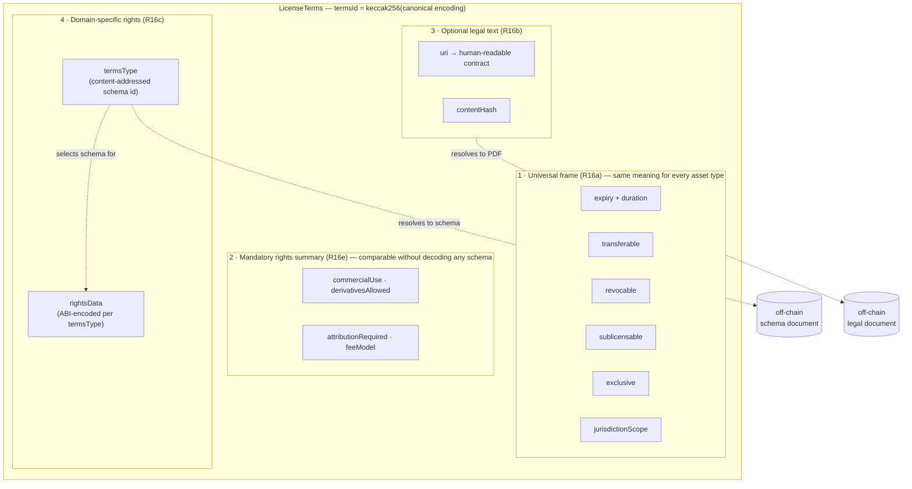
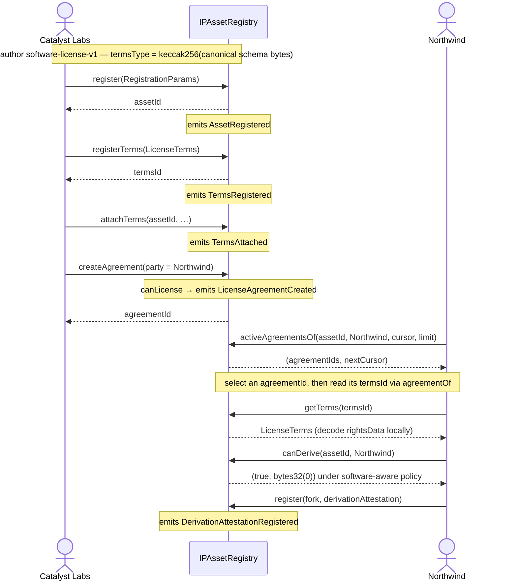

# Key Interaction Flows

> Status: companion to `core_architecture.md` and `requirements.md`.
> Where the architecture doc describes the *shape* of the system and the
> requirements doc expands the authoritative `erc-draft.md`, this doc walks through
> concrete *end-to-end flows* so an implementer or integrator can see how the
> pieces compose in practice. Core interfaces and types are defined in
> `src/interfaces/IIPAssetRegistry.sol` and `src/interfaces/IPAssetTypes.sol`.
> Snippets omit setup; software schemas and signing helpers are illustrative.
>
> Worked example used throughout: a software library is registered as an IP
> Asset, a software-specific rights schema is authored, terms are attached,
> and a commercial license is granted to a downstream integrator.

## 0. Cast of actors and contracts

| Actor / contract | Role in the example |
| --- | --- |
| **Catalyst Labs** | The studio that wrote the library. Acts as **registrant** and **owner** (admin). |
| **Ada, Brij** | The two declared human **authors** (R10–R11). |
| **Northwind Inc.** | A downstream integrator who wants to ship the library commercially — the **licensee**. |
| **`IPAssetRegistry`** | The conforming core contract (R0) where the asset, terms, attachments, and agreements live. |

The same address MAY play several of these roles; the ERC keeps them
independently addressable (Design Philosophy #4). In this example Catalyst
Labs is both registrant and owner, and Ada and Brij are authors only.

---

## 1. What "registering a new asset type 'software'" actually means

This is the first thing worth clarifying, because it splits into two
*independent* concepts that are easy to conflate:

1. **Asset type** (`assetType`, R7) — *descriptive* metadata. It is an open
   `bytes32`, conventionally `keccak256(<lowercase string>)`. **There is no
   onchain "register an asset type" step.** `"software"` is already a
   well-known constant:

   ```solidity
   bytes32 constant ASSET_TYPE_SOFTWARE = keccak256("software"); // IPAssetTypes.sol
   ```

   No core function dispatches on `assetType`; it is a label that catalogs
   and humans read. If you wanted a *narrower* type (`"software/library"`,
   `"firmware"`, …) you would simply `keccak256` your own string and use it —
   still no registration, no permission, no gatekeeper.

2. **Rights schema** (`termsType`, R16c) — the part that carries *behavior*
   for the licensing layer. Software rights (fork/modify, redistribute,
   patent grant, copyleft, field-of-use, …) do not fit the four-field
   `generic-license-v1` fallback, so software needs its own
   **content-addressed rights schema**. *This* is the artifact you author and
   (optionally) publish. It is what the user means by "creating per-asset
   rights".

So the real "new asset type for software" work is: **author a
`software-license-v1` rights schema**, derive its content-addressed
`termsType`, and (optionally) publish the schema through an
extension-defined discovery mechanism (R16d). The core ERC ships exactly one schema
(`generic-license-v1`); every domain schema — including this one — is an
extension-tier artifact (R16c).

---

## 2. Authoring the `software-license-v1` rights schema

A rights schema is two things together:

- **canonical schema bytes** describing the ABI layout and semantics of each
  field (the generic schema is defined inline in the ERC draft), and
- the **`bytes32 termsType` = `keccak256(canonical schema bytes)`** that
  pins it (R16c). Content addressing means the id *is* the integrity check:
  nobody can change the meaning of a known `termsType` without producing a
  different id.

For `generic-license-v1`, hash the exact single JSON line in
[ERC draft §1.6](erc-draft.md#16-well-known-constants) as UTF-8, without fences,
a BOM, surrounding whitespace, or a line terminator. Do not reserialize or
normalize the JSON; neither Markdown document is the hash preimage.

### 2.1 Proposed `rightsData` layout for software

What properties do we want a software license to express? Software rights are
materially different from the generic flags — they involve source vs. binary,
patents, copyleft, and field-of-use. A reasonable v1 payload:

```solidity
// Canonical ABI layout for termsType == TERMS_TYPE_SOFTWARE_V1.
// rightsData = abi.encode(SoftwareLicenseV1Rights(...))
struct SoftwareLicenseV1Rights {
    // -- usage --
    bool    commercialUse;          // may ship in revenue-generating products
    bool    internalUseOnly;        // restricts to internal tooling (no distribution)

    // -- modification & distribution --
    bool    modificationAllowed;    // may fork / modify source
    bool    redistributionAllowed;  // may redistribute (modified or not)
    bool    sourceDisclosureRequired; // copyleft: must publish source of derivatives
    bytes32 copyleftScope;          // keccak256("none") | ("file") | ("library") | ("strong")

    // -- patents --
    bool    patentGrant;            // express grant of contributor patents
    bool    patentRetaliation;      // grant terminates on patent suit by licensee

    // -- scope --
    bytes32 fieldOfUse;             // keccak256("any") | ("research") | ("defense-excluded") | …
    uint32  seatLimit;              // 0 = unlimited; else max deployed seats/instances
    string  attributionTemplate;    // NOTICE-file text; placeholders per generic-v1 §3.4
}
```

> The fields above are **illustrative** — `software-license-v1` is not part of
> the normative core, so its exact shape is an extension-spec decision. The
> point is the *mechanism*: whatever fields you choose, you freeze them in a
> canonical document and the document's hash becomes `termsType`.

### 2.2 Where each licensing property lives

This is the key "what is stored where" answer for licensing. The six
**universal-frame** properties are *not* part of `rightsData` — they live on
the outer `LicenseTerms` struct and mean the same thing for every asset type
(R16a). The mandatory `rights` summary is also outside `rightsData` (R16e).

| Property | Lives in | Why |
| --- | --- | --- |
| `expiry`, `duration`, `transferable`, `revocable`, `sublicensable`, `exclusive`, `jurisdictionScope` | `LicenseTerms` universal frame (R16a) | Properties of the *relationship*, invariant across asset types/jurisdictions. `sublicensable` is recorded only; it creates no core sublicense relationship. |
| `commercialUse`, `derivativesAllowed`, `attributionRequired`, `feeModel` | Mandatory `LicenseTerms.rights` (R16e) | Fixed, cross-schema summary; recorded by the core without enforcing rights semantics. |
| `commercialUse`, `modificationAllowed`, `patentGrant`, `copyleftScope`, … | `LicenseTerms.rightsData`, decoded per `termsType` (R16c) | Domain detail; opaque to the core. Any restated summary dimensions must agree. |
| Optional human-readable legal wrapper | At `LicenseTerms.uri`, hashed by `contentHash` (R16b) | Adds legal detail without overriding frame or summary; a hash does not prove enforceability. |
| The schema *definition* (field meanings) | Canonical schema bytes hash to `termsType`; discovery is extension-defined (R16d) | Schemas evolve at extension cadence; core stores the id, not the definition. |

### 2.3 (Optional) publish the schema

The core defines no schema registry. Catalyst Labs publishes the canonical
schema bytes (for example on IPFS) and may announce them through any
extension-defined discovery mechanism (R16d). Consumers verify
`keccak256(schema bytes) == TERMS_TYPE_SOFTWARE_V1`; those that hard-code the
schema need no lookup, exactly like `generic-license-v1`.

---

## 3. Flow A — Registering the software asset

Catalyst Labs registers the library. The asset record is the onchain source
of truth for ownership, authorship, type, and the metadata pointer; the work
itself (the source tree) stays off-chain, anchored by `contentHash` (R3, R6a).

### 3.1 Pre-flight (optional, free)

Any agent MAY call the read-only hook first to check feasibility without
spending gas (R9, R31):

```solidity
(bool ok, bytes32 reason) = registry.canRegister(catalystLabs, params); // non-reverting eligibility check
```

### 3.2 The call

```solidity
Author[] memory authors = new Author[](2);
authors[0] = Author(ada, 1);
authors[1] = Author(brij, 1);
RegistrationParams memory params = RegistrationParams({
    salt:              keccak256(sourceTarball),     // assetId = keccak256(abi.encode(chainId, registry, msg.sender, salt))
    owner:             catalystLabs,                 // admin role (R5)
    authors:           authors,
    sharesDenominator: 2,                            // Ada 1/2, Brij 1/2 (R11)
    assetType:         ASSET_TYPE_SOFTWARE,          // descriptive label (R7)
    tokenization:      AssetTokenization.NONE,       // off-chain work, registry-tracked owner (R4)
    tokenCollection:   address(0),                   // ignored for NONE
    tokenId:           0,                            // ignored for NONE
    metadataURI:       "ipfs://bafy.../library-manifest.json",
    contentHash:       keccak256(sourceTarball),     // REQUIRED for NONE (R6a)
    derivationAttestation: emptyAttestation          // every field empty/zero: no claim made (R23)
});

bytes32 assetId = registry.register(params);         // emits AssetRegistered (R29)
```

Notes that matter:

- **`tokenization == NONE`** because the library is an off-chain work and we
  want the registry in the ownership path. `contentHash` is therefore
  **mandatory** (R6a) — it is the only tamper-evidence handle on the source.
  (If we instead minted an ERC-721 to represent the library, we'd set
  `ERC721` + a `(collection, tokenId)` binding and `ownerOf` would delegate to
  the NFT per R5.)
- **`derivationAttestation` is canonically empty** — every field is empty or
  zero, including `issuer == address(0)`. Any other field populated alongside a
  zero issuer is invalid. The absence of an attestation means
  *no onchain statement was made* about provenance, which is distinct from
  asserting "original work" (R23). If the library were a fork, we'd supply a
  signed attestation here, at registration only, immutable thereafter (R24).
- The **registrant** (`msg.sender = catalystLabs`) is recorded in the
  `AssetRegistered` event for audit but stored nowhere on the record and given
  no ongoing authority (R8).

### 3.3 What is stored where after Flow A

| Datum | Location | Mutability |
| --- | --- | --- |
| `assetId` | Registry, unique in-registry id (R1) | immutable |
| owner = Catalyst Labs | Asset record (because `NONE`, R5) | mutable via `transferOwnership` |
| authors `[ada, brij]`, denominator `2` | Asset record (R10–R11) | **immutable** |
| `assetType = software` | Asset record (R7) | immutable |
| `metadataURI` | Asset record pointer (R6a) | mutable by owner |
| `contentHash` | Asset record's original-work digest (R6a) | **immutable** |
| descriptive metadata (name, repo, language, SPDX, version) | off-chain manifest at `metadataURI` | mutable; not covered by the work's `contentHash` |
| canonical reference `ipid:<chainId>:<registry>/<assetId>` | derivable, no storage (R2) | n/a |

---

## 4. Flow B — Authoring and attaching the license terms

Now Catalyst Labs decides *how* the library may be licensed. This is two
distinct steps: **register reusable terms** (R17), then **attach** them to the
asset (R18).

A `LicenseTerms` record is four layers: a **universal frame** (relationship
properties the core understands), a **mandatory rights summary** (a fixed,
cross-schema vocabulary agents can compare without decoding anything), an
**optional legal text** pointer/hash pair, and a **domain-specific rights** payload
selected by a content-addressed `termsType`. The whole struct is
content-addressed — its `termsId` is the keccak256 of its canonical encoding.
These layers MUST agree: legal prose and domain payloads add detail but do not
override the universal frame or specified summary values.



In this software example the layers are filled as: frame =
`{expiry: 0, duration: 730d, transferable: false, revocable: false, sublicensable: true, exclusive: false,
jurisdictionScope: worldwide}`; rights summary =
`{commercialUse: YES, derivativesAllowed: YES, attributionRequired: YES,
feeModel: ONE_TIME}`; legal text = the commercial PDF + its hash;
rights = `termsType = TERMS_TYPE_SOFTWARE_V1` over an ABI-encoded
`SoftwareLicenseV1Rights` payload. The core reads the frame directly and records
the summary; it never decodes `rightsData` — that is the consumer's / hook's job
per `termsType` (R16c).


### 4.1 Register the terms (content-addressed, reusable)

Catalyst Labs wants a **commercial, modify-allowed, weak-copyleft,
patent-granting, worldwide, 2-year** software license:

```solidity
SoftwareLicenseV1Rights memory rights = SoftwareLicenseV1Rights({
    commercialUse:            true,
    internalUseOnly:          false,
    modificationAllowed:      true,
    redistributionAllowed:    true,
    sourceDisclosureRequired: true,
    copyleftScope:            keccak256("library"),   // LGPL-style: changes to the lib, not the app
    patentGrant:              true,
    patentRetaliation:        true,
    fieldOfUse:               keccak256("any"),
    seatLimit:                0,                       // unlimited seats
    attributionTemplate:      "Includes \"{assetTitle}\" by {authorName} - {licenseURI}"
});

LicenseTerms memory terms = LicenseTerms({
    // 1. universal frame (R16a) — same meaning for any asset type
    expiry:            0,            // no shared absolute hard deadline
    duration:          uint64(730 days),
    transferable:      false,        // the license may not be re-sold by Northwind
    revocable:         false,        // no ordinary owner revocation
    sublicensable:     true,         // legal/downstream assertion; no core sublicense action
    exclusive:         false,        // others may license the same library too
    jurisdictionScope: JURISDICTION_WORLDWIDE,

    // 2. mandatory rights summary (R16e) — comparable without decoding rightsData
    rights: RightsSummary({
        commercialUse:       Ternary.YES,
        derivativesAllowed:  Ternary.YES,   // modification allowed
        attributionRequired: Ternary.YES,
        feeModel:            FeeModel.ONE_TIME
    }),

    // 3. authoritative legal text (R16b)
    uri:               "ipfs://bafy.../catalyst-commercial-v1.pdf",
    contentHash:       keccak256(legalPdfBytes),

    // 4. domain-specific rights (R16c)
    termsType:         TERMS_TYPE_SOFTWARE_V1,
    rightsData:        abi.encode(rights)
});

bytes32 termsId = registry.registerTerms(terms);   // termsId = keccak256(canonical encoding); emits TermsRegistered
```

Properties worth calling out:

- **`termsId` is content-addressed** (R17). Two registrants submitting the
  same terms get the same id; re-registration succeeds as an event-free no-op. Terms are immutable
  — "updating" means registering a *new* `termsId`.
- **Terms are reusable** (R17). Catalyst Labs can attach this same `termsId` to
  many libraries. Another registry can mirror the exact terms value and obtain
  the same `termsId`; `ipterms:<chainId>:<registry>/<termsId>` identifies the
  source record for off-chain discovery but is not directly attachable.
- **The frame vs. rights split is doing real work here.** The core acts on
  `expiry`, `duration`, `revocable`, and some `transferable` cases. It only records and
  exposes `sublicensable` and `exclusive` for legal or downstream policy use;
  this flow does not create a sublicense relationship. `modificationAllowed` /
  `patentGrant` / … are opaque to the core and only meaningful once a consumer
  decodes `rightsData` per `termsType`.

### 4.2 Attach the terms to the asset

Registering terms grants nothing. Attaching makes them *eligible* for
agreement creation against this specific asset (R18):

```solidity
registry.attachTerms(
    assetId,
    termsId,
    abi.encode(/* attachmentParameters: fee receiver, price, who-may-acquire, … */)
);                        // emits TermsAttached
```

- `attachmentParameters` is **public onchain, opaque to the core** (R18).
  Extensions may encode prices, fee receivers, or KYC acquisition policies;
  the core neither parses nor enforces the payload.
- Detaching later (`detachTerms`) blocks *new* agreements but never
  invalidates existing ones (R18).

### 4.3 What is stored where after Flow B

| Datum | Location |
| --- | --- |
| `LicenseTerms` struct (frame + summary + optional legal wrapper + `termsType`/`rightsData`) | Registry, keyed by content-addressed `termsId` (R17) |
| full legal contract PDF | off-chain at `terms.uri`, hashed by `terms.contentHash` |
| attachment `(termsId, attachmentParameters)` | Asset record's attached-terms list (R18, `attachedTermsOf`) |

---

## 5. Flow C — Granting / acquiring the license

There are two entry points (R19): owner/delegate-authorized `createAgreement`,
and `acquireAgreement` for the caller. Both also enforce `canLicense` (R19, R31)
and emit `LicenseAgreementCreated`.

### 5.1 Path 1 — owner grants directly (`createAgreement`)

Catalyst Labs grants Northwind a named license. Registry-tracked (`NONE`)
because we want registry-controlled transfers; revocation is per-agreement in both modes:

```solidity
AgreementParams memory ap = AgreementParams({
    assetId:               assetId,
    termsId:               termsId,
    party:                 northwind,                 // licensee; MUST be non-zero for NONE (R19)
    agreementTokenization: AgreementTokenization.NONE,
    agreementCollection:   address(0),                // ignored for NONE
    agreementTokenId:      0,                         // ignored for NONE
    licenseParams:         "",                        // opaque; forwarded to canLicense
    acceptanceHash:        acceptanceHash              // optional evidence commitment
});

bytes32 agreementId = registry.createAgreement(ap);  // checks canLicense; emits LicenseAgreementCreated
```

### 5.2 Path 2 — licensee self-serves (`acquireAgreement`)

If Catalyst Labs wants a "click-to-license" flow, Northwind calls against the
attached terms itself; `canLicense` + `attachmentParameters` + `licenseParams`
carry the policy (e.g. payment confirmation):

```solidity
bytes32 agreementId = registry.acquireAgreement(
    assetId, termsId, licenseParams, acceptanceHash
);
```

### 5.3 A note on tokenization choice (R22)

- **`NONE`** (used above): the registry stores `party = northwind`. Secondary
  transfer is possible only if `terms.transferable == true` and `canTransferAgreement`
  allows it (here `transferable == false`, so the license is effectively
  soulbound to Northwind). Revocation/freeze go through the registry.
- **`ERC721`**: the agreement is bound to a license NFT; the licensee is
  whoever holds the token. Good for tradable/bearer licenses ("mint now, sell
  later"). The registry is *not* in the transfer path, so any transferability
  or eligibility restrictions must be enforced inside the token contract. Editions = N
  single-holder agreements; there is no ERC-1155 multi-holder agreement (R22).

### 5.4 What is stored where after Flow C

| Datum | Location |
| --- | --- |
| `agreementId` | Registry, unique in-registry id (R19) |
| bound `(assetRegistry, assetId)` + local `termsId` | Agreement record |
| licensee | `party = northwind` for `NONE`; bound-token holder for `ERC721` (R22) |
| tokenization binding | Agreement record (R22) |
| immutable creation evidence | `AgreementEvidence`: licensor snapshot, creator, initial licensee, timestamp, mode, `licenseParamsHash`, `acceptanceHash` (R19) |
| captured lifecycle frame | effective absolute expiry derived from terms' `expiry`/`duration`, plus `transferable` and `revocable`; expiry and ordinary revocability are registry-enforced, while transferability is registry-enforced only for `NONE` (R19/R22) |
| complete creation log | `LicenseAgreementCreated` carries the binding, evidence, token binding, and captured frame (R29) |
| activity (expiry/revoked/frozen) | derived on read by `isAgreementActive` etc. (R20) |
| canonical reference `ipagreement:<chainId>:<registry>/<agreementId>` | derivable, no storage (R19) |

---

## 6. Flow D — Using and verifying the license

Anyone — Northwind, a marketplace, an AI build agent, a payment module — can
inspect agreement activity permissionlessly and without reverting (R20):

```solidity
registry.isActiveAgreementHolder(agreementId, assetId, northwind); // witness check
registry.activeAgreementsOf(assetId, northwind, 0, 100); // bounded discovery page
registry.isAgreementActive(agreementId);          // neither expired, revoked, nor frozen
registry.getLicensee(agreementId);                // northwind (NONE) or token holder (ERC721)
registry.activeAgreementsOf(assetId, 0, 100);     // paginated: (page, nextCursor) of active ids (R27a)
```

To answer a *software-specific* question — "may Northwind ship a modified
binary commercially?" — a consumer reads the agreement's `termsId`, fetches
the `LicenseTerms`, and decodes `rightsData` per `TERMS_TYPE_SOFTWARE_V1`:

```solidity
require(
    registry.isActiveAgreementHolder(agreementId, assetId, northwind),
    "inactive or wrong holder"
);
(, bytes32 termsId,,,,,,,) = registry.agreementOf(agreementId);
LicenseTerms memory t = registry.getTerms(termsId);
require(t.termsType == TERMS_TYPE_SOFTWARE_V1, "unexpected schema");
SoftwareLicenseV1Rights memory r = abi.decode(t.rightsData, (SoftwareLicenseV1Rights));
bool mayShip = r.commercialUse && r.modificationAllowed && r.redistributionAllowed;
```

The core never decodes `rightsData` itself — that's the whole point of the
content-addressed `termsType` split. Decoding is the consumer's / hook's job
(R16c). Each decision must use the terms bound to the same active agreement;
activity from one agreement cannot be combined with rights from another. This
abbreviated domain predicate assumes consistent terms layers; other conditions
and legal permission still require evaluation.

---

## 7. Flow E — Derivation (a downstream fork)

Suppose Northwind forks the library into a new product and wants to register
*that* as its own asset. The pre-flight question is "may Northwind derive from
this parent under current state?" (R26):

```solidity
(bool mayFork, bytes32 reason) = registry.canDerive(assetId, northwind);
```

A schema-aware `canDerive` could scan
`activeAgreementsOf(assetId, northwind, cursor, limit)` and return
`(true, bytes32(0))` when the same active agreement's terms permit modification,
accounting for copyleft obligations. To establish absence, scan until
`nextCursor == agreementCountOf(assetId)`; `limit` bounds examined records, not
matches. This is an illustrative software policy, not the core default.

When Northwind registers the fork it supplies a **derivation attestation**
(R23–R25) pointing back at the parent:

```solidity
bytes32 registrationHash = hashRegistration(forkRegistration, northwind);
ParentRef[] memory parents = new ParentRef[](1);
parents[0] = ParentRef(chainId, address(registry), assetId);
DerivationAttestation memory att = DerivationAttestation({
    parents:   parents,
    issuer:    forkToolOrNorthwind,     // self-attestation or a signing build tool
    signature: sigOverCanonicalEncoding,// verified by the core (R25)
    metadata:  abi.encode("git-sha:...", "build-pipeline:..."),
    registrationHash: registrationHash
});
// passed in RegistrationParams.derivationAttestation of the new asset's register() call
```

The exact R23 EIP-712 digest binds the new `assetId`, intended registrant, every
registration field, parents, and metadata. The issuer must therefore know the
complete registration before signing. `assetId` remains pre-computable because
it is derived from a registrant-chosen `salt` (R1): Northwind fixes the payload,
computes its id and `registrationHash`, has the build tool sign, and submits all
of it in one atomic `register` call (R24).

The core **verifies the signature and emits
`DerivationAttestationRegistered`**, not proof of actual parent usage or permission.
Graph traversal belongs to extensions. `canDerive` exposes advisory parent policy;
`canRegister` applies child-registration policy (R25/R26).

---

## 8. End-to-end sequence at a glance



---

## 9. Summary — what is stored where

A single table consolidating the "what is stored where" thread that runs
through every flow:

| Concept | Onchain in registry | Onchain elsewhere | Off-chain / referenced material |
| --- | --- | --- | --- |
| Asset identity, owner, authors, type | ✅ asset record | optional asset NFT binding, not necessarily work bytes | — |
| Asset metadata pointer | ✅ mutable `metadataURI` plus immutable work `contentHash` | — | ✅ descriptive manifest; not covered by the work hash |
| The work itself (source, in this example) | — | — | ✅ canonical source bytes anchored by `contentHash` |
| License terms (frame + summary + legal wrapper + `termsType`/`rightsData`) | ✅ complete tuple keyed by `termsId` | — | optional legal contract at `terms.uri`, hashed by `terms.contentHash` |
| Rights *schema definition* | — | (extension-defined discovery, if any) | ✅ canonical schema byte range hashes to `termsType` |
| Term attachment to asset | ✅ attached-terms list including raw public `attachmentParameters` | — | only separately referenced material, if any |
| License agreement (binding + evidence + licensee + activity) | ✅ agreement record | (license NFT if `ERC721`) | — |
| Derivation provenance | ✅ complete `DerivationAttestation`, including raw public `metadata` | parents may be cross-registry/chain | only separately referenced evidence, if any |
| Compliance facts (KYC, sanctions, ratings) | ✅ claims (R6d/R30) | (identity systems, extension) | — |

**Complete terms, attachments, claims, and derivation metadata are public
onchain.** Opaque does not mean private. Separately referenced material is
integrity-covered only when its bytes are the documented hash preimage.
