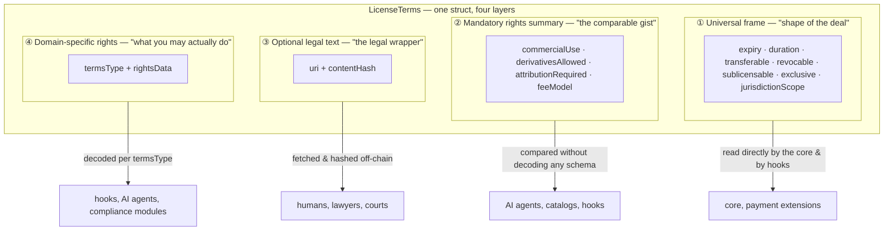
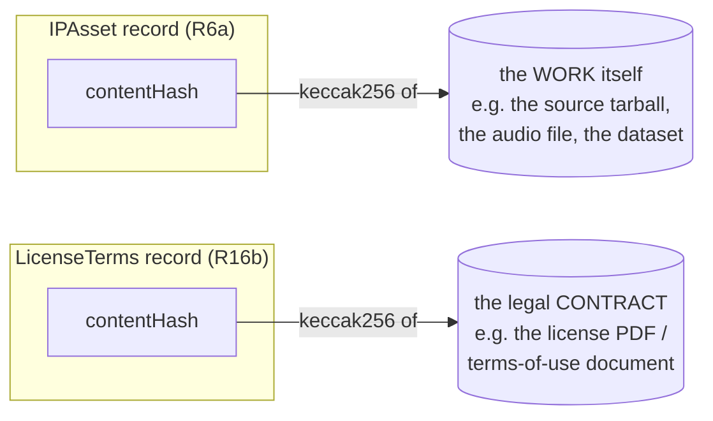
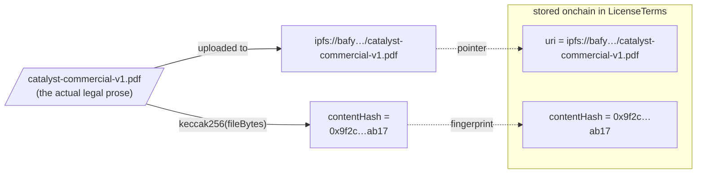
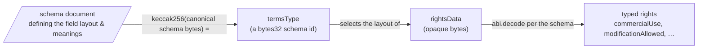
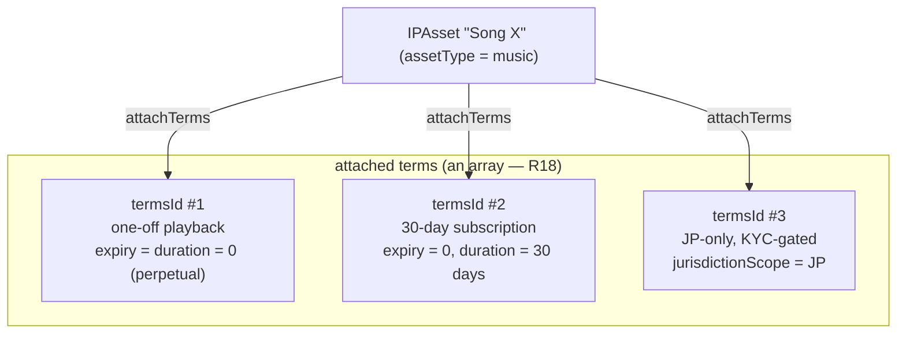
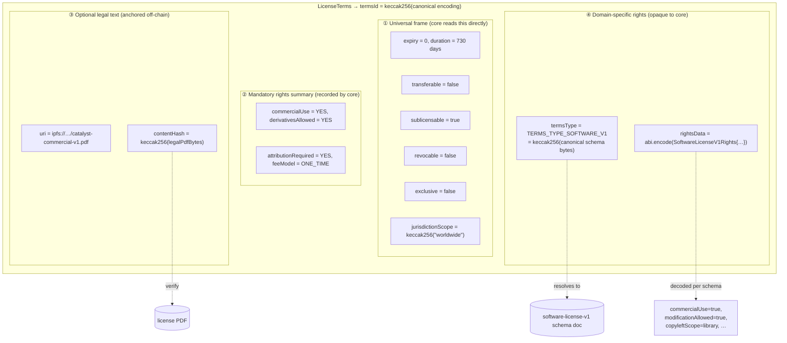

# License Terms, explained — a visual guide

> This document is a gentle, picture-first
> walkthrough of `LicenseTerms` for new readers. It does not add or change any
> requirement. The normative text lives in `erc-draft.md` (see `requirements.md`, R16–R16e);
> the generic schema's canonical JSON bytes are included in that draft;
> the end-to-end worked example lives in `key_interaction_flows.md`.

## Why this document exists

`LicenseTerms` packs a lot into one struct, and two fields trip up almost
everyone the first time:

- **`contentHash`** — *what exactly is being hashed, and why?* (Made worse by
  the fact that there are **two different `contentHash` fields** in the ERC.)
- **`rightsData`** — *what is in those opaque bytes, and who reads them?*

A natural follow-on question gets its own section too:

- **the rights layer** — *can one asset carry several different licenses (a
  one-off vs. a subscription, or different terms per jurisdiction)?* (Yes — see
  §4.)

This guide answers all of these with diagrams and concrete byte-level examples.

---

## 1. The 30-second mental model

A `LicenseTerms` record is **four layers in one struct**. The trick is that
each layer answers a different question and is read by a different audience.



| Layer             | Fields | Who reads it | Does the core understand it? |
|-------------------| --- | --- | --- |
| 1 Universal frame | `expiry`, `duration`, `transferable`, `revocable`, `sublicensable`, `exclusive`, `jurisdictionScope` | the core contract, payment extensions | **Yes** — same meaning for every asset type (R16a) |
| 2 Rights summary  | `rights` (`commercialUse`, `derivativesAllowed`, `attributionRequired`, `feeModel`) | AI agents, catalogs, hooks | No — recorded only; a fixed, cross-schema vocabulary agents can compare without decoding any domain schema (R16e) |
| 3 Optional legal text | `uri`, `contentHash` | humans / lawyers | No — it just *anchors* a legal document (R16b) |
| 4 Rights         | `termsType`, `rightsData` | hooks, agents, compliance modules | **No, deliberately** — opaque bytes the core never decodes (R16c) |

> **The summary is a floor, not a ceiling.** Layer 2 is always present (even when
> `termsType == bytes32(0)`) so that an agent can compare terms it has never seen
> before. It is tri-state (`UNSPECIFIED`/`YES`/`NO`) so terms can stay honestly
> silent on a dimension. Layer 4 MAY refine it with domain nuance but MUST NOT
> contradict it. `feeModel` classifies fee *structure* only — never amounts,
> currencies, or tokens, which belong to the payment extension.

> **"Understands" ≠ "enforces."** The core reads and stores every frame field,
> but it only *enforces* `expiry`/`duration`, `revocable` for ordinary revocation,
> and, for `NONE`, `transferable`. Force revocation remains an administrative path.
> ERC-721 transfer restrictions require token-level enforcement. `sublicensable`, `exclusive`, and
> `jurisdictionScope` are **recorded only** — faithfully stored for hooks,
> payment / jurisdiction / asset-graph extensions, agents, and courts to act
> on. The core never prevents overlapping "exclusive" grants or onward
> sublicensing by itself. In fact, it has no sublicense action or parent-agreement
> field, and `createAgreement` remains asset-owner-authorized. A sublicense must
> be represented by an extension that defines that relationship and grant
> authority; otherwise `sublicensable` is only a downstream/legal assertion. See the
> enforcement-responsibility table in R16a.

The whole struct is itself content-addressed: its `termsId` is
`keccak256(canonical encoding of the struct)`, which is why identical terms
always get the same id and terms are reusable across assets (R17).

---

## 2. What does `contentHash` hash? (and which one?)

There are **two `contentHash` fields** in this ERC, in two different structs.
They work the same way — `keccak256` of exact bytes — but they anchor
**different artifacts**. Confusing them is the #1 source of "wait, what is this
hashing?".



| | `IPAsset.contentHash` (R6a) | `LicenseTerms.contentHash` (R16b) |
| --- | --- | --- |
| Hashes… | the **creative work** (source code, audio, image, dataset bytes) | the **human-readable legal document** describing the license |
| Paired with… | `metadataURI` (descriptive manifest) | `uri` (the legal document) |
| Purpose | tamper-evidence for the original work, not automatically its metadata | tamper-evidence for the legal document |
| Mutability | immutable once set | immutable once set |
| May be `bytes32(0)`? | no for `NONE`; yes for `ERC721` | yes — only with `uri == ""` (no separate legal text) |

This document is about the **`LicenseTerms.contentHash`** (the right-hand
column), but it helps to know the asset one exists so you don't mix them up.

### 2.1 Why hash the legal document at all?

The onchain struct is the **machine-readable protocol representation** of the
license. An optional document at `uri` supplies legal prose, anchored byte for
byte by `contentHash`. Neither its presence nor a matching hash establishes
legality or enforceability.

"Authoritative" does not mean that prose silently overrides onchain fields.
The layers MUST be consistent. The universal frame controls deterministic
registry behavior, and each specified summary value is the coarse
machine-readable assertion consumers compare. The legal document supplies
definitions and detail the struct cannot express. If they conflict, the terms
are non-conforming; consumers reject or flag them, while a court's treatment is
outside this ERC.



Verification later is trivial and permissionless:

1. Read `uri` and `contentHash` from the terms.
2. Fetch the document from `uri`.
3. Check `keccak256(downloadedBytes) == contentHash`.
4. If it matches, the document is exactly the one the terms were registered
   against. If it doesn't, someone swapped the file — reject it.

Because the hash is stored onchain and immutable, **nobody can quietly edit
the contract** after the fact: changing one byte changes the hash, and the
mismatch is detectable by anyone.

> A separate wrapper is optional: omit both (`uri == ""` and
> `contentHash == bytes32(0)`). A schema such as `generic-license-v1` can supply
> normative license text without a separate PDF (R16b).

---

## 3. What is `rightsData`, exactly?

`rightsData` adds **domain-specific rights detail** to the mandatory summary —
modification, redistribution, patent grants, and so on. What "derivative" means
for a song may differ from software or a dataset; any restated summary dimension
must remain consistent with the summary.

The core stores fixed `RightsSummary` fields; schema-specific detail uses:



Two fields working as a pair:

- **`termsType`** — `keccak256(canonical schema bytes)`, pinning the field layout
  and meanings (R16c). For `generic-license-v1`, hash the single JSON line in
  [ERC draft §1.6](erc-draft.md#16-well-known-constants) as UTF-8, excluding fences,
  a BOM, surrounding whitespace, and its line terminator. Do not reserialize,
  normalize, or hash an entire Markdown file.
- **`rightsData`** — the ABI-encoded bytes of the struct that the schema
  describes. The core **never** decodes these; it stores and returns them
  verbatim. Decoding is the job of whoever asks a rights question — a hook, an
  AI agent, a compliance module (R16c).

### 3.1 From struct → bytes (what's literally in `rightsData`)

`rightsData = abi.encode(<the schema's struct>)`. Here's the smallest case,
`generic-license-v1`, whose schema is four fields:

```solidity
// TERMS_TYPE_GENERIC_V1 hashes the exact canonical JSON line in ERC draft
// section 1.6, without fences, surrounding whitespace, or a line terminator.
struct GenericLicenseV1Rights {
    bool   commercialUse;        // may I use it commercially?
    bool   derivativesAllowed;   // may I make derivatives?
    bool   attributionRequired;  // must I credit the author?
    string attributionTemplate;  // how the credit must read
}

GenericLicenseV1Rights memory r = GenericLicenseV1Rights({
    commercialUse:       false,
    derivativesAllowed:  true,
    attributionRequired: true,
    attributionTemplate: "Based on \"{assetTitle}\" by {authorName}, {year}"
});

bytes memory rightsData = abi.encode(r);   // <-- this is what gets stored
```

This payload requires the outer summary values `NO`, `YES`, and `YES`
respectively. `UNSPECIFIED` is not valid for a dimension restated by a generic
boolean: the boolean necessarily makes an assertion, so generic-schema
consumers reject any mismatch.

`abi.encode(r)` includes an outer offset because the struct is a dynamic tuple:

```text
rightsData (32-byte ABI words; numeric leading zeros abbreviated)
word 0  0x0000…0020   outer offset to tuple start (word 1) = 32 bytes
word 1  0x0000…0000   commercialUse       = false (0)
word 2  0x0000…0001   derivativesAllowed  = true  (1)
word 3  0x0000…0001   attributionRequired = true  (1)
word 4  0x0000…0080   string offset from tuple start = 128 bytes
word 5  0x0000…002f   string length = 47 bytes
word 6  0x4261736564206f6e20227b61737365745469746c657d22206279207b61757468
word 7  0x6f724e616d657d2c207b796561727d0000000000000000000000000000000000
```

Words 6–7 contain the 47 UTF-8 string bytes followed by 17 zero padding bytes.
`rightsData` is **a typed struct, serialized**; a schema-aware decoder recovers
the named booleans and string.

### 3.2 A richer schema: software

Different asset, different schema, different `rightsData` layout — but the
*mechanism* is identical. Rich software rights exceed the four-field generic schema, so a
`software-license-v1` schema defines more fields (illustrative, from
`key_interaction_flows.md` §2.1):

```solidity
struct SoftwareLicenseV1Rights {
    bool    commercialUse;
    bool    internalUseOnly;
    bool    modificationAllowed;
    bool    redistributionAllowed;
    bool    sourceDisclosureRequired;  // copyleft
    bytes32 copyleftScope;             // keccak256("none"|"file"|"library"|"strong")
    bool    patentGrant;
    bool    patentRetaliation;
    bytes32 fieldOfUse;                // keccak256("any"|"research"|…)
    uint32  seatLimit;                 // 0 = unlimited
    string  attributionTemplate;
}
// rightsData = abi.encode(SoftwareLicenseV1Rights(...))
```

Same envelope, more letters inside. The core still stores `rightsData` as
opaque bytes and still never looks inside.

### 3.3 Who decodes it, and how

To answer "may Northwind ship a modified binary commercially?", a consumer
fetches the terms and decodes per the schema (from `key_interaction_flows.md`
§6):

```solidity
require(
    registry.isActiveAgreementHolder(agreementId, assetId, northwind),
    "inactive or wrong holder"
);
(, bytes32 termsId,,,,,,,) = registry.agreementOf(agreementId);
LicenseTerms memory t = registry.getTerms(termsId);
require(t.termsType == TERMS_TYPE_SOFTWARE_V1, "unexpected schema");
SoftwareLicenseV1Rights memory r = abi.decode(t.rightsData, (SoftwareLicenseV1Rights));
bool mayShip = r.commercialUse && r.modificationAllowed && r.redistributionAllowed;
```

The terms and active state must come from the same `agreementId`. A boolean
showing that some other agreement is active cannot authorize use under these
terms. This abbreviated domain predicate assumes the terms' layers are consistent;
other conditions and legal permission still require evaluation.

If the consumer doesn't recognize `termsType`, it fetches the schema document
(through any extension-defined discovery mechanism, R16d), verifies the hash, learns the layout,
and decodes accordingly. The core was never involved in any of that.

---

## 4. Domain-specific rights, in practice (one asset, many licenses)

"Domain-specific" means detail beyond the fixed summary uses a schema chosen by
a content-addressed `termsType` (§3), rather than expanding the core's fields.
Two consequences:

- **A `termsType` is not bound to an `assetType`.** The core never enforces a
  pairing — R16c only says implementations *SHOULD* reject *conventionally
  incompatible* ones (a music schema on a patent asset). So one asset type like
  `"music"` can have **many** schemas: `music-playback-v1`,
  `music-subscription-v1`, `music-sync-v1`, …
- **The rights vary on two levels.** The *schema* (`termsType`) fixes the
  **vocabulary** — which fields exist and what they mean — and is *domain-shaped*
  (a music schema vs. a software schema). The *values* (`rightsData`) are
  **per-terms-record**: two licenses on the *same* song under the *same* schema
  can grant completely different rights.

| Level | What it sets | Varies by |
| --- | --- | --- |
| **Schema** (`termsType`) | the rights *vocabulary* (fields + meanings) | domain (music, software, dataset, …) |
| **Values** (`rightsData`) | the rights *actually granted* | each individual `LicenseTerms` record |

In short: the rights you get are a property of **which `LicenseTerms` record you
are looking at**, decoded through a domain-shaped schema — *not* a function of
the asset's type. That is why `assetType` (R7) is just a descriptive label and
`termsType` (R16c) is the thing that shapes rights: they are independent axes.

### 4.1 Many licensing models for one asset → attach many terms

You express different business models by **attaching several `LicenseTerms`
records to the same asset** (R17/R18). `attachTerms` builds an *array* of
allowed terms (`attachedTermsOf`); the licensee picks which one to acquire.



Each record is a full `LicenseTerms` (frame + summary + optional legal wrapper +
`termsType`/`rightsData`). Records may share a schema or use different schemas;
all layers within each record must agree.

### 4.2 Where each part actually goes

The four layers plus the hook/compliance surface divide the labour like this:

| What you want to express | Where it lives | Mechanism |
| --- | --- | --- |
| One-off playback **vs.** subscription (different *products*) | **multiple attached `LicenseTerms`** | one `termsId` per product on the same asset (R17/R18) |
| "commercial use? derivatives? attribution? fee shape?" | **mandatory rights summary** `rights` | fixed tri-state + `feeModel` vocabulary agents compare without decoding any schema (R16e) |
| "valid for 30 days from each agreement's creation" | **universal frame** `duration = 30 days`, `expiry = 0` | `duration` is per-agreement; nonzero `expiry` adds a shared absolute cap (R16a) |
| recurring billing / auto-renewal | **payment extension**, not core | the core gives you `duration`/`expiry`; recurring charging is out of core scope |
| different rights **per jurisdiction** | **universal frame** `jurisdictionScope` | attach a JP terms and a US terms separately; jurisdiction is a property of the whole terms set (R16a) |
| domain rights (playback-only, stems, sync, …) | **`rightsData`** under a music `termsType` | different field values, or a different schema if structurally different (R16c) |
| "in JP we require KYC; only these KYC providers count" | **hook / compliance surface, *not* `rightsData`** | enforced at acquisition by `canLicense` (R19/R31), configured via `attachmentParameters` (opaque to core) and/or asset **claims** (R6d/R30) + party-identity extensions (R35–R37) |

The key split: **`rightsData` describes the *rights granted*** (what the
licensee may do); **eligibility gating like KYC describes *who may acquire***
and is a *policy* decision the `canLicense` hook makes at sale time. Keeping KYC
out of the rights schema is deliberate — it lets the core stay neutral while
implementers plug in arbitrary compliance policy (R31).

---

## 5. Full worked example — everything in one picture

A commercial, modify-allowed, weak-copyleft, worldwide, 2-year software license
(the running example from `key_interaction_flows.md` §4):



```solidity
LicenseTerms memory terms = LicenseTerms({
    // ① universal frame — same meaning for any asset type (R16a)
    expiry:            0,
    duration:          uint64(730 days),
    transferable:      false,
    sublicensable:     true,
    revocable:         false,        // ordinary owner revocation prohibited
    exclusive:         false,
    jurisdictionScope: JURISDICTION_WORLDWIDE,

    // ② mandatory rights summary (R16e)
    rights: RightsSummary({
        commercialUse:       Ternary.YES,
        derivativesAllowed:  Ternary.YES,
        attributionRequired: Ternary.YES,
        feeModel:            FeeModel.ONE_TIME
    }),

    // ③ optional legal text (R16b)
    uri:               "ipfs://bafy.../catalyst-commercial-v1.pdf",
    contentHash:       keccak256(legalPdfBytes),

    // ④ domain-specific rights (R16c)
    termsType:         TERMS_TYPE_SOFTWARE_V1,
    rightsData:        abi.encode(rights)        // SoftwareLicenseV1Rights{...}
});

bytes32 termsId = registry.registerTerms(terms); // termsId = keccak256(canonical encoding)
```

---

## 6. Cheat sheet — four hashes, don't mix them up

The ERC leans heavily on content addressing, so several different `keccak256`
values float around. Here's all of them in one place:

| Hash | Preimage (what is hashed) | Field / constant | Spec |
| --- | --- | --- | --- |
| Asset content hash | the **creative work** bytes (source, audio, dataset) | `IPAsset.contentHash` | R6a |
| Legal-text hash | the **license document** bytes (the PDF) | `LicenseTerms.contentHash` | R16b |
| Schema id | **canonical schema bytes** (for generic v1, the inline JSON defined in §3) | `LicenseTerms.termsType` | R16c |
| Terms id | the **canonical encoding of the whole `LicenseTerms` struct** | `termsId` | R17 |

**Onchain records include complete terms and opaque payloads, not just hashes.**
Work, legal text, and schemas may be separately referenced; `metadataURI` alone
does not hash-cover a descriptive manifest.

---

## 7. Common confusions, answered

**"Is `rightsData` encrypted?"** No. It's plain ABI-encoded bytes. Anyone can
read it; they just need the schema (`termsType`) to know what the fields mean.
"Opaque" means *the core contract* doesn't interpret it — not that it's hidden.

**"Does the core store `commercialUse` as a field?"** Yes, in the mandatory
`RightsSummary` (R16e). Additional domain detail lives in `rightsData`, selected
by `termsType`, so new schemas need not revise the core. Restated dimensions
must agree with the summary (R16c).

**"Can one asset have several different licenses?"** Yes — see §4. A `termsType`
is not bound to an `assetType`; one asset can have many attached terms records
(one-off vs. subscription vs. per-jurisdiction), each its own schema/frame.

**"Where do subscription duration and per-jurisdiction terms go?"** Duration →
the frame's `duration` (optionally capped by absolute `expiry`); jurisdiction → the frame's `jurisdictionScope`; the two
*products* (one-off vs. subscription) → two attached `LicenseTerms` records.
Recurring billing itself is a payment-extension concern, not core (§4.2).

**"Where does KYC / 'allowed KYC providers' live?"** Not in `rightsData`. It's an
*eligibility* gate enforced at acquisition by the `canLicense` hook, configured
via `attachmentParameters` and/or claims + party-identity extensions
(R6d/R30/R31/R35–R37). `rightsData` says what the licensee *may do*; the hook
says *who may acquire* (§4.2).

**"What if two people pick different `termsType`s for the same rights?"** That's
fine — they're different schemas, and consumers decode each per its own schema.
Reusability/dedup happens at the `termsId` level: identical structs ⇒ identical
`termsId`.

**"Do I have to publish a legal PDF?"** No. Omit the wrapper with `uri = ""` and
`contentHash = bytes32(0)` together (R16b). A schema such as `generic-license-v1`
can supply normative text; legal enforceability remains outside the ERC.

**"Which `contentHash` does the license layer care about?"** Only
`LicenseTerms.contentHash` (the legal document). `IPAsset.contentHash` belongs
to the asset/registration layer (the work itself). See §2.
